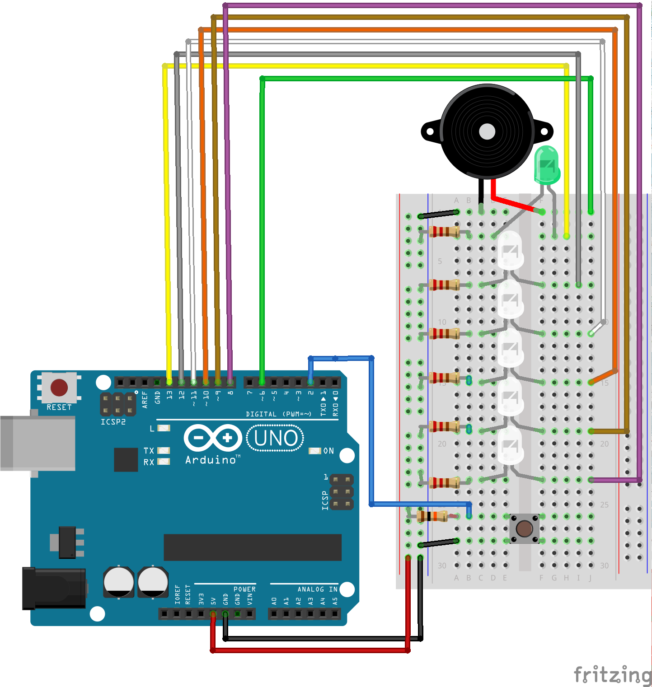
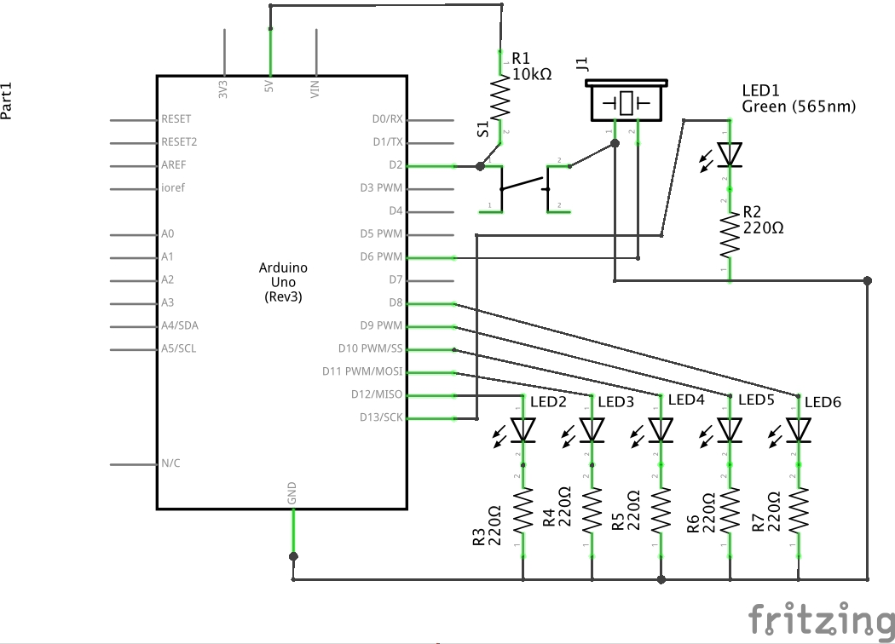

# barbeque_timer
Timer lets you know when to turn over meat.
First assembled on Arduino UNO but then remade for Nano.

<h2>Components</h2>
<li>Arduino Nano</li>
<li>1 green LED</li>
<li>4 white LEDs</li>
<li>5 x 220 Ohm resistors</li>
<li>Button</li>
<li>10kOhm resistor</li>
<li>Buzzer</li>
<li>Wires</li>
<li>Breadboard</li>

<h2>Breadboard connection</h2>

<h2>Schematic</h2>

